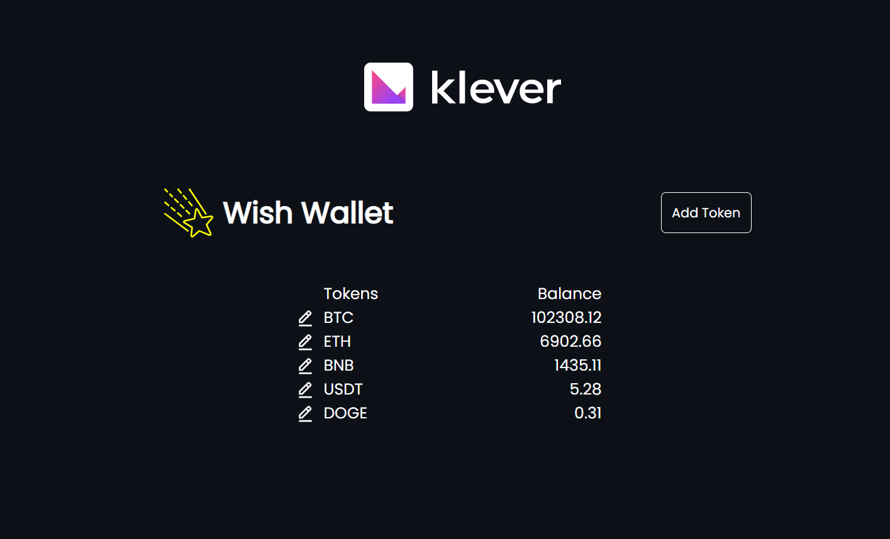
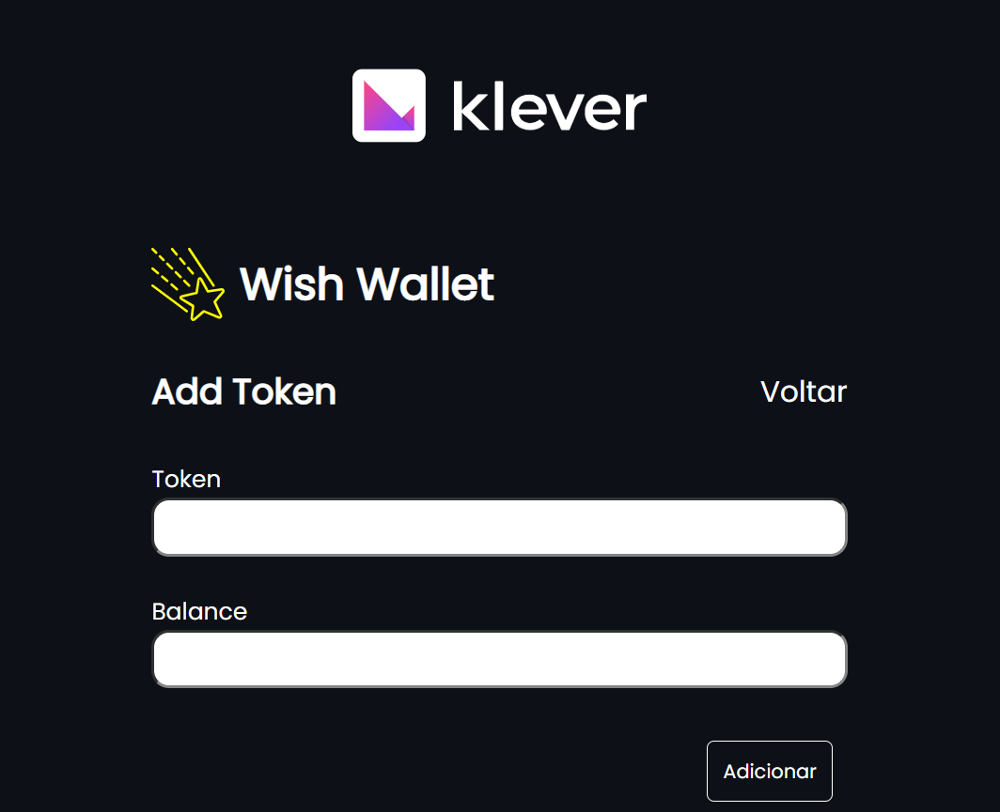

# Klever Cripto Wallet

  

    
    
  

 

## 💻 Projeto

A ideia desse aplicativo é entregar a experiência de uma carteira digital que armazena dados sobre cripto moedas de uma forma simplificada!

 

## 🚀 Tecnologias

Esse projeto foi desenvolvido com as seguintes tecnologias:

Front-end:

> Desenvolvido usando: NextJS, Sass, Axios, Formik, Yup, Prettier, ESlint, e algumas bibliotecas ícones

 

## ⬇️ Instalando dependências

Após clonar o projeto:

`yarn`

### ⬇️ Depois de instaladas as dependências:

`yarn dev`

#### Por padrão uma porta irá abrir na url: http://localhost:3000

 

## 📌 Habilidades

Nesse projeto, fui capaz de:

- Aprimorar minhas habilidades no NextJS
- Utilizar o axios para fazer solicitações a minha API mockada no NextJS
- Aprimorar minha organização de código

 

## 📝 Ajustes e melhorias

O projeto possui melhorias pendentes, e possíveis atualizações serão voltadas nas seguintes tarefas:

- [ ] Adicionar uma requisição Axios que ao invés de puxar da minha API mockada, puxe de uma API externa com dados em tempo real de cryptos, favoritadas pelo usuário!
- [ ] Desenvolver um sistema de login e tornar as rotas de home/addToken/editToken privadas pro usuário autenticado!
- [ ] Desenvolvedor testes unitários para a aplicação!

 

## 🚩 Desenvolvimento

 

#### A decisão de usar o NextJS foi para ganhar tempo e aumentar a performance na aplicação, apesar de não utilizar o SSR na aplicação, acredito que o tempo ganho sem ter que fazer configurações de rotas, criando um backend simples para a primeira requisição do site, fazer longas configurações de inicio de projeto e afins, valeram bastante a pena!

 

#### Assim que o site carrega pela primeira vez, uma função do meu contexto faz a checagem do localStorage pra ver se já existe a chave da minha aplicação, se já existir ele captura e preenche meu contexto com elas, se não existir ele faz uma requisição na minha API e guarda todas as chaves que retornar no contexto!

 

#### Na tela de adicionar uma nova chave, foram utilizadas duas bibliotecas para fazer validações e agilizar o processo do formulário, o Formik e o Yup, após validar a quantidade mínima e máxima de caracteres, exigir uma string ou número nos campos, e fazer validações para checar se aquele token já existe, quando o botão de enviar é liberado meu contexto é atualizado com o novo array de tokens, e uma função é chamada para atualizar meu Local Storage imediatamente, e logo em seguida o usuário é redirecionado para a tela de Home novamente, onde ele vai aguardar um timeOut de 1 segundo acabar para carregar novamente os tokens disponíveis, esse nas atualizações do contexto foi pensando para simular o tempo de espera de uma requisição a API!

 

#### Na tela de editar token o processo é semelhante ao de adicionar, porém o nome do token não pode ser alterado, apenas seu balanço, além de editar o token, é possível remove-lo, nesse caso irá aparecer um popUp pra confirmar a retirada do token, então o contexto é atualizado, em seguida o Local Storage e o usuário é levado a tela principal para aguardar o loading acabar!

 

#### No projeto não foi utilizada uma pasta src para seguir os padrões do NextJS, toda a estilização foi feita em SCSS para manter a organização do CSS clara e ganhar algum tempo utilizando do @include para copiar estilos de forma rápida!

 

## 🔗 Links & referências

> https://nextjs.org/docs

> https://formik.org/docs/tutorial

> https://axios-http.com/docs/example

> Github: https://github.com/JoaumVictor

> Linkedin: https://www.linkedin.com/in/victorfausto/

> Email: joaumvictor.oficial@gmail.com
